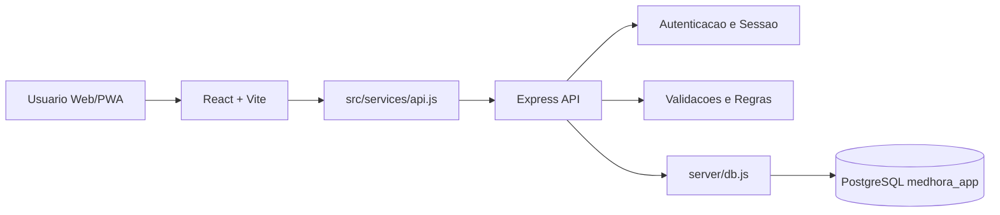
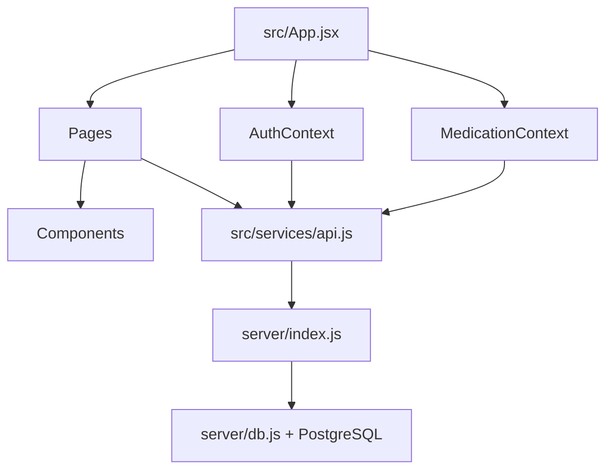
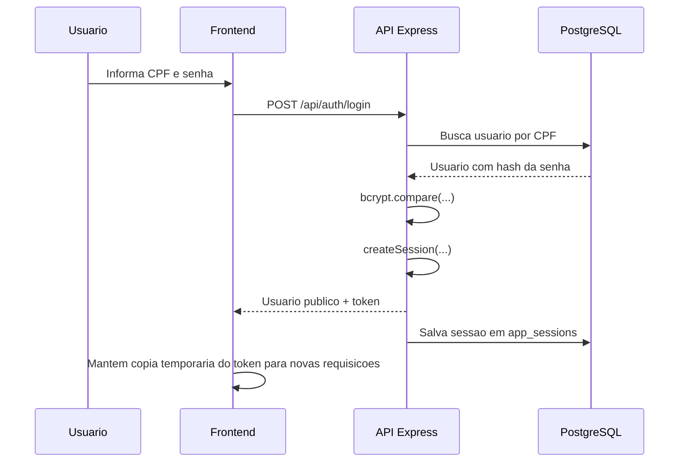
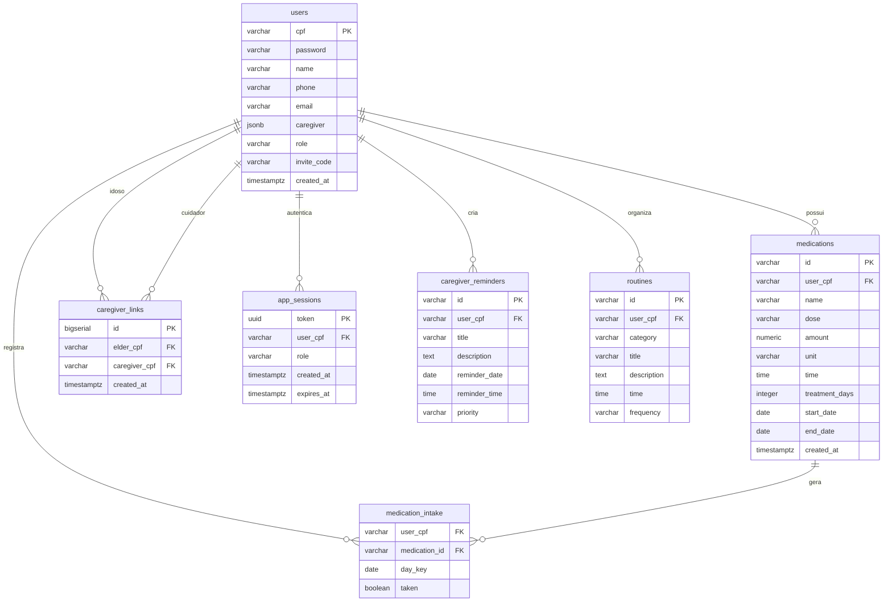

# MedHora - Diagramas

Este documento concentra os diagramas tecnicos do MedHora.

## Arquitetura Atual

```mermaid
flowchart LR
  User[Usuario Web/PWA] --> UI[React + Vite]
  UI --> ApiClient[src/services/api.js]
  ApiClient --> Express[Express API]
  Express --> Auth[Autenticacao e Sessao]
  Express --> Rules[Validacoes e Regras]
  Express --> Db[server/db.js]
  Db --> Pg[(PostgreSQL medhora_app)]
```

## Diagrama de Componentes

```mermaid
flowchart TD
  App[src/App.jsx] --> AuthProvider[AuthContext]
  App --> MedicationProvider[MedicationContext]
  App --> Pages[Pages]
  Pages --> Components[Components]
  Pages --> Api[src/services/api.js]
  AuthProvider --> Api
  MedicationProvider --> Api
  Api --> Backend[server/index.js]
  Backend --> Database[server/db.js + PostgreSQL]
```

## Fluxo de Autenticacao

```mermaid
sequenceDiagram
  participant U as Usuario
  participant F as Frontend
  participant A as API Express
  participant D as PostgreSQL

  U->>F: Informa CPF e senha
  F->>A: POST /api/auth/login
  A->>D: Busca usuario por CPF
  D-->>A: Usuario com hash da senha
  A->>A: bcrypt.compare(...)
  A->>A: createSession(...)
  A-->>F: Usuario publico + token
  A->>D: Salva sessao em app_sessions
  F->>F: Mantem copia temporaria do token para novas requisicoes
```

## Modelo de Dados

```mermaid
erDiagram
  users ||--o{ medications : possui
  users ||--o{ medication_intake : registra
  medications ||--o{ medication_intake : gera
  users ||--o{ caregiver_links : idoso
  users ||--o{ caregiver_links : cuidador
  users ||--o{ app_sessions : autentica
  users ||--o{ caregiver_reminders : cria
  users ||--o{ routines : organiza

  users {
    varchar cpf PK
    varchar password
    varchar name
    varchar phone
    varchar email
    jsonb caregiver
    varchar role
    varchar invite_code
    timestamptz created_at
  }

  medications {
    varchar id PK
    varchar user_cpf FK
    varchar name
    varchar dose
    numeric amount
    varchar unit
    time time
    integer treatment_days
    date start_date
    date end_date
    timestamptz created_at
  }

  medication_intake {
    varchar user_cpf FK
    varchar medication_id FK
    date day_key
    boolean taken
  }

  caregiver_links {
    bigserial id PK
    varchar elder_cpf FK
    varchar caregiver_cpf FK
    timestamptz created_at
  }

  app_sessions {
    uuid token PK
    varchar user_cpf FK
    varchar role
    timestamptz created_at
    timestamptz expires_at
  }

  caregiver_reminders {
    varchar id PK
    varchar user_cpf FK
    varchar title
    text description
    date reminder_date
    time reminder_time
    varchar priority
  }

  routines {
    varchar id PK
    varchar user_cpf FK
    varchar category
    varchar title
    text description
    time time
    varchar frequency
  }
```
