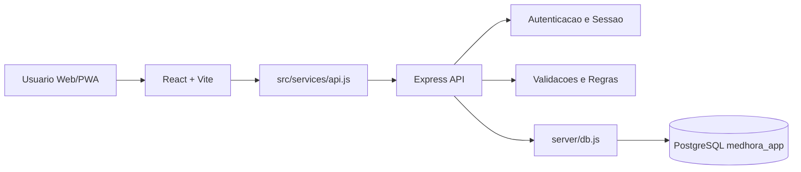
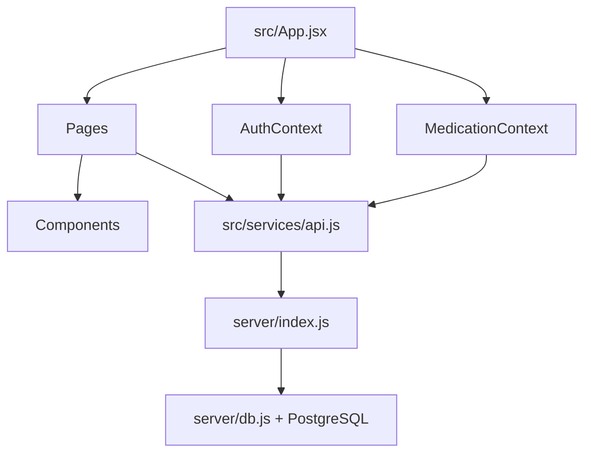
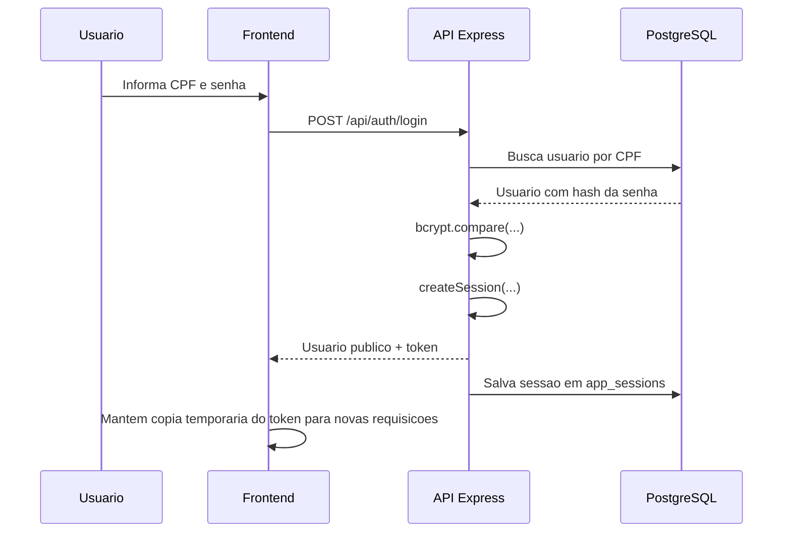
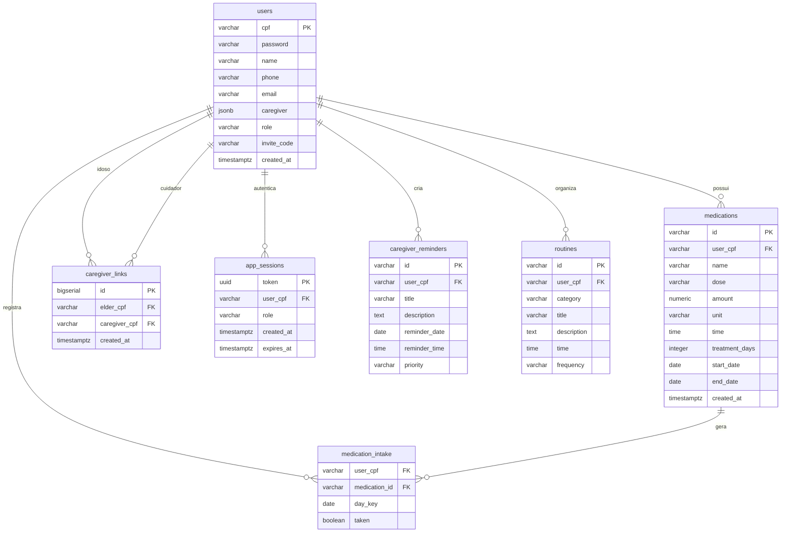

# MedHora - Compatibilidade entre Sistema e Documentacao

Este documento confirma a compatibilidade entre o sistema implementado e a documentacao tecnica do projeto. Ele cobre requisitos, arquitetura, diagramas e padroes de projeto observados no codigo atual.

## Escopo Validado

- Frontend: React + Vite em `src/`.
- Backend: Express em `server/index.js`.
- Banco de dados: PostgreSQL com schema `medhora_app` em `server/schema.sql`.
- Integracao HTTP centralizada em `src/services/api.js`.
- Seguranca basica: CORS por ambiente, senha com hash bcrypt e sessoes persistidas no PostgreSQL.

## Requisitos Funcionais

| ID | Requisito | Status | Evidencia no sistema |
| --- | --- | --- | --- |
| RF01 | Permitir cadastro de usuario idoso ou cuidador | Implementado | `POST /api/auth/register` em `server/index.js` |
| RF02 | Permitir login por CPF e senha | Implementado | `POST /api/auth/login` em `server/index.js` |
| RF03 | Invalidar sessao no logout | Implementado | `POST /api/auth/logout` e `activeSessions.delete(...)` |
| RF04 | Recuperar senha | Fora do escopo atual | Fluxo de recuperacao removido do backend e do frontend |
| RF05 | Atualizar perfil do usuario | Implementado | `PATCH /api/users/:cpf` |
| RF06 | Criar vinculo cuidador/idoso | Implementado | `POST /api/users/:cpf/relations/link` |
| RF07 | Remover vinculo cuidador/idoso | Implementado | `DELETE /api/users/:cpf/relations/:linkedCpf` |
| RF08 | Cadastrar medicamento com dose, unidade, horarios e duracao | Implementado | `POST /api/users/:cpf/medications` |
| RF09 | Listar medicamentos ativos do dia | Implementado | `GET /api/users/:cpf/medications` |
| RF10 | Excluir medicamento | Implementado | `DELETE /api/users/:cpf/medications/:id` |
| RF11 | Marcar medicamento como tomado ou pendente | Implementado | `POST /api/users/:cpf/medications/:id/toggle-taken` |
| RF12 | Buscar medicamentos na base ANVISA local | Implementado | `GET /api/medications/search` |
| RF13 | Exibir dashboard com resumo do usuario e vinculos | Implementado | `GET /api/users/:cpf/dashboard` |
| RF14 | Gerar relatorio semanal e mensal de tratamento | Implementado | `GET /api/users/:cpf/reports` |
| RF15 | Criar lembretes do cuidador | Implementado | Persistido em `caregiver_reminders` no PostgreSQL |
| RF16 | Criar rotinas/lembretes do idoso | Implementado | Persistido em `routines` no PostgreSQL |

## Requisitos Nao Funcionais

| ID | Requisito | Status | Evidencia no sistema |
| --- | --- | --- | --- |
| RNF01 | Frontend nao acessa PostgreSQL diretamente | Implementado | Frontend usa `src/services/api.js`; banco fica em `server/db.js` |
| RNF02 | API deve proteger rotas por sessao | Implementado | `requireSelfAccess(...)` em `server/index.js` |
| RNF03 | Senhas devem ser protegidas | Implementado | `bcrypt.hash(...)` e `bcrypt.compare(...)` |
| RNF04 | CORS deve ser configuravel por ambiente | Implementado | `CORS_ORIGIN` em `server/index.js` |
| RNF05 | Banco deve manter integridade relacional | Implementado | FKs em `server/schema.sql` |
| RNF06 | Medicamentos devem ter periodo ativo valido | Implementado | `start_date`, `end_date` e constraints no schema |
| RNF07 | API deve retornar dados publicos do usuario, sem senha | Implementado | `toPublicUser(...)` |
| RNF08 | Sessoes persistidas no backend | Implementado | Tabela `app_sessions` no PostgreSQL |
| RNF09 | Auditoria de acoes sensiveis | Pendente | Previsto em `docs/ARCHITECTURE.md`, ainda sem tabela/rotas |
| RNF10 | Migracoes versionadas de banco | Pendente | Existe `server/schema.sql`, mas nao ha pasta de migrations |
| RNF11 | App mobile Expo/React Native consumindo a mesma API | Pendente | Previsto no roadmap, ainda nao implementado |

## Compatibilidade HTTP

| Metodo | Existe no backend | Uso atual |
| --- | --- | --- |
| GET | Sim | Healthcheck, dashboard, relatorios, busca e listagem |
| POST | Sim | Login, cadastro, logout, vinculos, criacao e marcacao |
| PUT | Nao | O projeto usa `PATCH` para atualizacao parcial |
| PATCH | Sim | Atualizacao de perfil |
| DELETE | Sim | Remocao de vinculo e medicamento |

## Arquitetura Atual

### Camadas

| Camada | Responsabilidade | Arquivos principais |
| --- | --- | --- |
| Interface | Telas, formularios, navegacao e feedback visual | `src/pages/`, `src/components/` |
| Estado do cliente | Usuario autenticado e medicamentos carregados | `src/context/AuthContext.jsx`, `src/context/MedicationContext.jsx` |
| Cliente HTTP | Contrato entre frontend e backend | `src/services/api.js` |
| API | Rotas, autenticacao, autorizacao e validacoes | `server/index.js` |
| Banco | Pool PostgreSQL e transacoes | `server/db.js` |
| Schema | Tabelas, indices e constraints | `server/schema.sql` |

## Diagrama de Componentes

## Fluxo de Autenticacao

## Modelo de Dados

## Padroes de Projeto e Organizacao

| Padrao | Onde aparece | Objetivo |
| --- | --- | --- |
| Layered Architecture | Separacao entre `src/`, `server/` e PostgreSQL | Evitar acesso direto ao banco pelo frontend |
| API Client | `src/services/api.js` | Centralizar chamadas HTTP e token de sessao |
| Context Provider | `AuthContext.jsx` e `MedicationContext.jsx` | Compartilhar estado global no React |
| Controller por rota | Handlers Express em `server/index.js` | Receber request, validar e responder |
| Data Access Helper | `query(...)` e `withDbTransaction(...)` em `server/db.js` | Concentrar acesso ao PostgreSQL |
| DTO/Public Mapper | `toPublicUser(...)`, `toLinkedUser(...)` | Evitar retorno de campos sensiveis |
| Schema-first simples | `server/schema.sql` | Declarar estrutura relacional do banco |

## Seguranca Confirmada

| Item | Status | Observacao |
| --- | --- | --- |
| Hash de senha | Implementado | `bcryptjs` com `SALT_ROUNDS = 10` |
| Comparacao segura de senha | Implementado | `bcrypt.compare(...)` |
| Migracao de senha legada | Implementado | Senha em texto puro e convertida para hash no primeiro login |
| Token de sessao | Implementado | `crypto.randomUUID()` e header `x-medhora-token` |
| Expiracao de sessao | Implementado | `SESSION_MAX_AGE_MS` e tabela `app_sessions` |
| Logout invalida token | Implementado | Remove token de `app_sessions` |
| CORS por ambiente | Implementado | `CORS_ORIGIN` |
| Criptografia de dados em repouso | Nao implementado | Dados como CPF, telefone e medicamentos nao sao criptografados no banco |
| HTTPS no Express | Nao implementado diretamente | Deve ser provido por proxy/deploy em producao |

## Pontos de Incompatibilidade ou Pendencia

| Ponto | Impacto | Recomendacao |
| --- | --- | --- |
| Auditoria ausente | Dificulta rastrear acoes sensiveis | Criar `audit_logs` e registrar eventos criticos |
| Migracoes ausentes | Risco em deploy e evolucao de schema | Adicionar migrations versionadas |
| PUT ausente | Nao e erro, mas deve estar documentado | Manter `PATCH` para atualizacao parcial |
| Credenciais locais no exemplo | Risco de exposicao acidental | Usar placeholders em `.env.example` |

## Conclusao

A documentacao e o sistema estao compativeis nos fluxos principais de autenticacao, medicamentos, vinculos, dashboard, relatorios, CORS e hash de senhas. As pendencias documentadas correspondem ao estado real do codigo: persistencia de lembretes/rotinas, auditoria, migrations e planejamento mobile.
